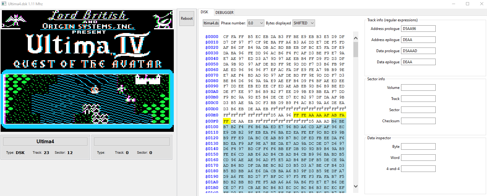

# Sixty

An Apple ][ emulator written in Kotlin.

Very much a work in progress.

# Goals

There are quite a few great Apple ][ emulators available and while I initially started this project because writing emulators
is fun and the Apple ][ has a special place in my heart, I also wanted to address a few areas that I thought even the
best emulators around don't address: make it very developer focused.

In particular, I wanted my emulator to offer a very deep look into what's happening inside the emulator, such as:
- A full on debugger.
- Being able to trigger full runtime 6502 traces based on conditions (e.g. "Display the listing between $800 and $8FF).
- Make it trivial to transfer bytes to and from the emulator. This is achieved with `FileWatcher`, which allow you
to tell Sixty to monitor files on your local computer, such as an assembled binary, and automatically transfer it.
to the Apple ][ memory, which allows developers to write their 6502 code on their system of choice (Windows/macOS/Linux/whichever)
and have it automatically uploaded to the emulator, ready to be run.
- Extend the support above to BASIC as well (write your Applesoft program on your OS, have it automatically uploaded).
- Run as many protected WOZ disks as possible, which means being very accurate in cycle timing, track reading, DISK II drive
emulation, including motor spinning up and down, etc...
- Run on any OS (hence my choice of using Kotlin).

I have made some decent progress on some of these goals but Sixty is still very far from being finished and it's
a lot of work for a single person with a real job.

# 6502

My 6502 emulator is pretty battle tested by now. Not only does it pass [Klaus' 6502 functional test suite](https://github.com/Klaus2m5/6502_65C02_functional_tests) but since it boots a few protected Woz disks that are very timing sensitive, I am reasonably confident
that its cycle counting is accurate as well (I didn't write tests for this, though).

# TODO

So much!

First of all, the emulator is slow. I am aware of it and I have a good idea of why (a lot of logging, subpar emulation
of the memory), but it's good enough to run at 1Mhz for now (it can go faster), but down the line,
some optimizations will have to be made. In particular, my approach to memory is all wrong. Right now, I calculate
what memory to access dynamically at each access, but I need to reverse that logic so that I do the heavy lifting whenever
a flag is changed (update all the banks) and then, each memory access is direct and does not require any new recomputations.

Other than that, rough TODO list:

- Write to disk
- updatePosition() when incrementing/decrementing track
- Second drive, other controllers $C500
- Shift/control
- Prodos
    - Hard drive
- Force.woz crashes at Woz.kt:151
- FileWatcher for Applesoft BASIC
- Toolbar
- Convert .dsk to .woz
- Support WOZ1 (test disk: Stellar 7)
- Fix graphics
- Fix animations
- Make keyboard work
- Double hi res (King's Quest)
- Rescue Raiders.woz flickers
- Joystick
- Turn off the motor at exactly 1M cycles ahead in time
- Find out why Commando doesn't boot when NibbleStrategy is BITS
- More protected woz disks

# Protected disks

I started paying more attention to protected disks, amid all the other items I want to add to the emulator. I kept a small diary of the protection issues that I faced and solved or didn't solve in [this document](https://docs.google.com/document/d/19xY3f80Y9kQurvek7vWUfV_BRGbJj-B5Sbjn_ax8hqY/edit?usp=sharing).

